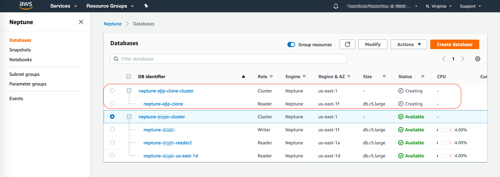

## Cloning Neptune Database

Create a clone copy of your aurora database by performing the following steps:

1.	Go to the [Neptune Console](https://console.aws.amazon.com/neptune/home)
2.	Click on **Databases** 
3.	Select your DB cluster `neptune-{yourname}-cluster`
4.	Choose instance **Actions**
5.	Select **Create clone**
 
6.	Enter the following values
    - **DB instance class**: **db.r5.large**
    - Under **Settings**, for **DB Instance identifier** enter `neptune-{yourname}-clone`
    - Under **Network & Security**, leave all the fields as default
    - Under **Database options**, choose **Enable IAM DB authentication**
    - Leave all other fields to their default value
    
7.	Click **Create Clone**

    !!! Note ""
        It may take a few minutes for the clone to become Available and notice that the Role will start as Reader then change to Writer.

    

## Compare Primary and Cloned database

In this section, we will delete records from the primary database and validate that the delete operation does not affect the cloned database.

Perform the following tasks on your Primary Database. 

TODO:

Perform the following tasks on your Cloned Database. 

TODO:

!!! Recap 
    Notice that the cloned records match the primary count prior to deletion. 
