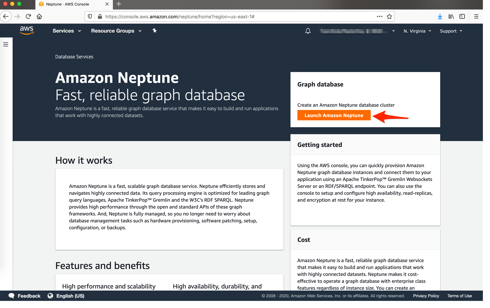
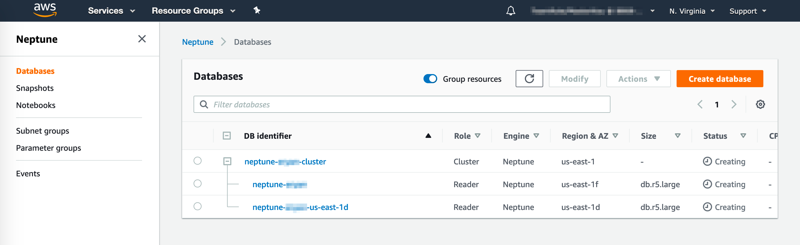
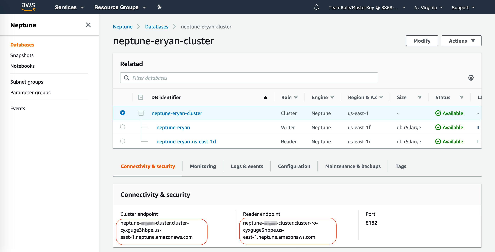
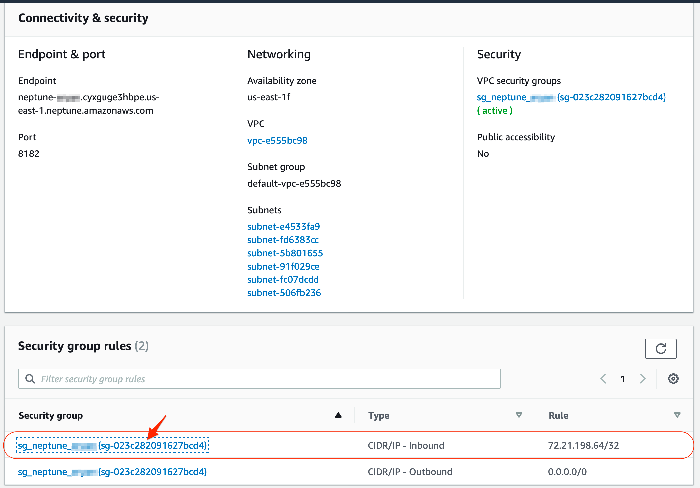
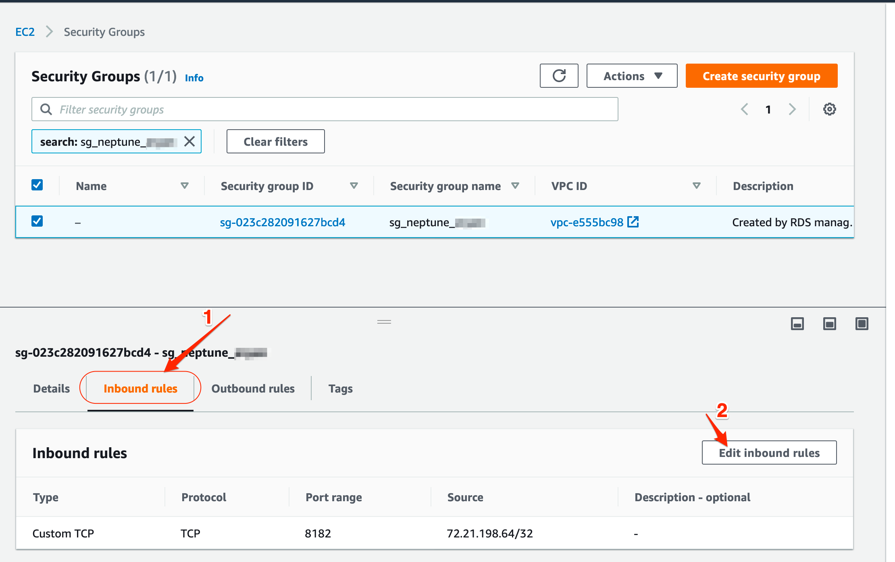
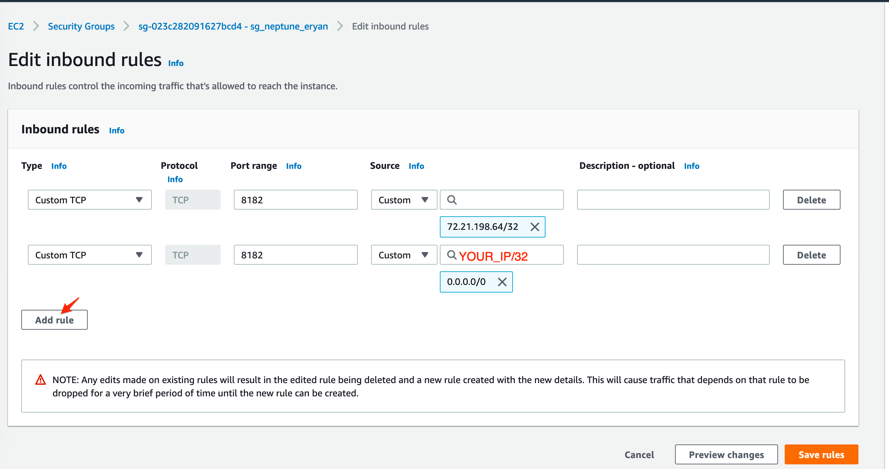
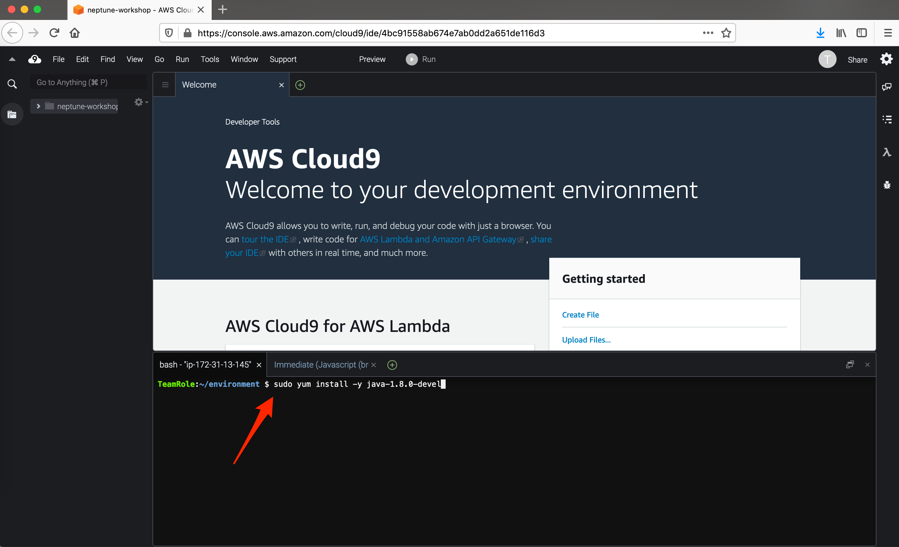
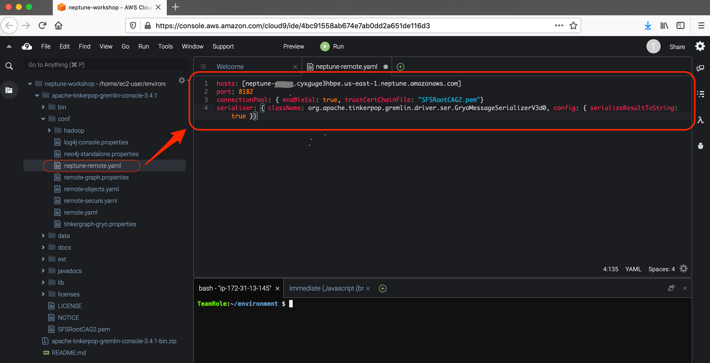
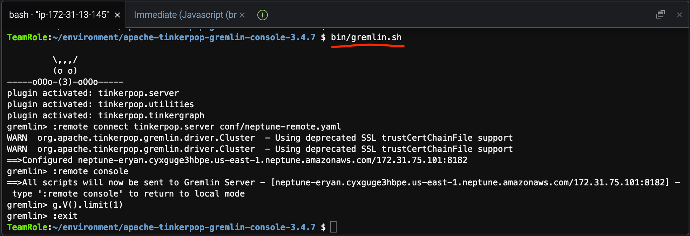

# Creating an Amazon Neptune Database Cluster

An Amazon Neptune DB cluster consists  of one or more DB instances and a cluster volume that represents the data for the DB cluster, copied across three Availability Zones as a single, virtual volume. The DB cluster contains a Primary DB Instance and, optionally, up to 15 Neptune Replicas.

- **Primary DB instance** – ==Supports read and write== operations and performs all the data modifications to the cluster volume. Each Neptune DB cluster ==has one primary DB instance==.
- **Neptune replica** – Connects to the ==same storage volume== as the primary DB instance and ==supports only read== operations. 


In this section, we will create a simple Neptune DB cluster with a primary node and a standby node.

## Create an Neptune DB cluster (Console)

1. In the AWS Management Console, on the **Services** menu, click [Neptune](https://console.aws.amazon.com/rds/).
2. In the top-right bar, select the AWS **Region** in which you want to create the Neptune DB cluster. 
3. In the **Dashboard** page, click **Launch Amazon Neptune**.
   
4. In the **Engine options** section, select latest version **Neptune 1.0.2.2.R2**
5. On the **Setting**, specify **DB cluster identifier** ==`neptune-{YOUR_NAME}-cluster`== (for example: `neptune-ejlp-cluster`)
6. For **Templates**, select **Production**.
       
    !!! Info 
        Selecting this option will makes Amazon Neptune maintain a synchronous replica in a different Availability Zone than the Primary DB instance. Amazon Neptune will automatically fail over to the replica in the case of a planned or unplanned outage of the Primary.
7. For **DB instance size**, select `db.r5.large` as the type of your EC2 instance for running the Neptune instance
8. On the **Availability & durability**, select **Create read replica in different AZ**
On the **Connectivity**, configure as following
    - **VPC**: Use default
    - **Subnet group**: Use default
    - **VPC security groups**: Create new VPC Security group, ==`sg_neptune_{YOUR_NAME}`==
    - **Database Port**: Use default (8182)
1.  It is good to always having a tag, add a Tag with "Key": `purpose` and "Value": `workshop-july-2020`
2.  
3.  Click **Additional Configuration**, Database options
    - **DB instance identifier**: ==`neptune-{YOUR_NAME}`==
    - **DB parameter group**: **default.neptune1**
    - **DB cluster parameter group**: **default.neptune1**
    - **Failover Priority**: **No preference**
    - **Backup retention period**: **1 day**
    - Uncheck **Enable Encryption**
    - Uncheck **Audit Log**
    - On Maintenance setting
      - Check **Enable auto minor version upgrade** 
      - Choose **Select window** for maintenance, and set the time as you wish
    - Uncheck **Enable deletion protection**

    Examine all the fields, and	leave the remanding sections to their default values and go to the bottom of the page. 

4.  Click **Create database**
    
    > Note: After clicking Create database the creating process will take some time to complete. You need to wait and click reload button on the top of the list for several times. 

    

17.	When your database instance status changes to Available.  Click  ==`neptune-{yourname}-cluster`== from the **DB indentifier** column
18.	Scroll down to **Connectivity & Security** section and note down your **Endpoints** (both the Reader and Writer endpoint).  These endpoints are needed in later sections of the lab.
    
    
 
    !!! Note
        When you have a read Replica, the reader endpoint will automatically use read replica for all read only queries. But if you only have one Neptune instance then reader endpoint will use Primary DB instance.    


Up to this point, you have created a new Neptune cluster with a Primary and Replica node.  The Replica node `neptune-{yourname}-{region-az}` can be promoted to Primary if the existing Primary database goes down.  In the next section, we will access the Primary Neptune node.

## Accessing your cluster

In this lab, we will be running Gremlin commands in the local computer or from Cloud9 IDE.  In order to access the Neptune cluster, you will need to open up proper **security groups** to enable connection between your local computer (or Cloud9 instace) and the Neptune node.  

To Enable traffic, perform the following:

1. Select Witer (Primary) database ==`neptune-{yourname}`==
2. On the **Connectivity & security** tab, select the security group that has Type: **CIDR/IP - Inbound**
   
   

3. Click on the **Inbound rules** tab
    

5.	Click on **Edit inbound rules**

6.	Modify the existing inbound rule 
    - Type: `Custom TCP` 
    - For **Source** fill in with your IP address of your machine and specify the address using the `/32` prefix length. Or you add open to the world usinf `0.0.0.0/0` (Not recommended for production!) 
    
    

    !!! Tips "Knowing your IP address"
        You can use a browser to know your IP address by accessing http://ifconfig.co or use command `curl ifconfig.co`
 
7.	Click **Save rules**

### Test Connection

We can now test our connection to Neptune Primary node's endpoint URL using HTTPS. 
We will use `curl` command.


1. Set location of CA certificate for `curl` 
   ```
   export CURL_CA_BUNDLE=/home/ec2-user/environment/apache-tinkerpop-gremlin-console-3.4.7/SFSRootCAG2.pem 
   ```
2. Use this command to check the status of the Neptune instance
   ```
   curl -v https://neptune-{YOURNAME}.xxxx.us-east-1.neptune.amazonaws.com:8182/status 
   ```
   If connection successful you shoud get following response:
   ```json
   { "status":"healthy",
     "startTime":"Sat Jul 18 06:35:36 UTC 2020",
     "dbEngineVersion":"1.0.2.2.R2",
     "role":"writer",
     "gremlin":{"version":"tinkerpop-3.4.3"},
     "sparql":{"version":"sparql-1.1"},
     "labMode":{
         "ObjectIndex":"disabled",
         "ReadWriteConflictDetection":"enabled"
     }
   }
   ``` 

3. You can also try simple Sparql query
   ```
   curl -v  -X POST \
   --data-binary 'query=select ?s ?p ?o where {?s ?p ?o}' \
   https://neptue-{YOURNAME}.xxxx.us-east-1.neptune.amazonaws.com:8182/sparql
   ```
   Because we are querying an empty DB, the result is very predictable:
   ```json
   {
       "head" : {
       "vars" : [ "s", "p", "o" ]
     },
     "results" : {
       "bindings" : [ ]
     }
   }   
   ```       

### Setup Gremlin Console

The following section walks you through installing and configuring the Gremlin Console to connect remotely to a Neptune DB instance.

The Gremlin Console is an interactive text based console. It allows you to experiment with TinkerPop graphs and queries in a REPL (read-eval-print loop) environment.


1. Go to Cloud9 tab in your browser
2. Run this commands in the Terminal of your Cloud9 IDE.
   ```bash
   sudo yum install -y java-1.8.0-devel
   sudo alternatives --set java /usr/lib/jvm/jre-1.8.0-openjdk.x86_64/bin/java
   export JAVA_HOME=/usr/lib/jvm/jre-1.8.0-openjdk.x86_64
   wget https://archive.apache.org/dist/tinkerpop/3.4.1/apache-tinkerpop-gremlin-console-3.4.1-bin.zip
   unzip apache-tinkerpop-gremlin-console-3.4.1-bin.zip
   cd apache-tinkerpop-gremlin-console-3.4.1
   wget https://www.amazontrust.com/repository/SFSRootCAG2.pem
   ```
   You access your terminal in 
   

3. In the `conf/` subdirectory of the extracted directory, create a file named `neptune-remote.yaml` with the following text. Replace `your-neptune-endpoint` with the hostname or IP address of your Neptune DB instance. The square brackets (`[ ]`) are required. 
   ```
   hosts: [your-neptune-endpoint]
   port: 8182
   connectionPool: { enableSsl: true, trustCertChainFile: "SFSRootCAG2.pem"}
   serializer: { className: org.apache.tinkerpop.gremlin.driver.ser.GryoMessageSerializerV3d0, config: { serializeResultToString: true }}
   ```
   Your file should look like this:
   

4. Start Gremlin Console 
   ```
   bin/gremlin.sh
   ```
   You are now at the `gremlin>` prompt. You will enter the remaining steps at this prompt.
   

5. At the `gremlin>` prompt, enter the following to connect to the Neptune DB instance.
   ```
   :remote connect tinkerpop.server conf/neptune-remote.yaml
   ```

6. At the `gremlin>` prompt, enter the following to switch to remote mode. This sends all Gremlin queries to the remote connection.
   ```
   :remote console
   ```
7. Enter the following to send a query to the Gremlin Graph.
   ```
   g.V().limit(1)
   ```
8. When you are finished, enter the following to exit the Gremlin Console.
   ```
   :exit
   ```
   Or you can also use  <kbd>CTRL</kbd>-<kbd>D</kbd>
   


