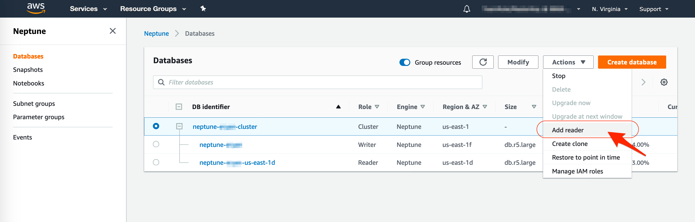

## Create New Read Replica

Neptune Replicas are independent endpoints in an Neptune DB cluster, best used for scaling read operations and increasing availability. The DB cluster volume is made up of multiple copies of the data for the DB cluster. However, the data in the cluster volume is represented as a single, logical volume to the primary instance and to Neptune Replicas in the DB cluster.

All Neptune Replicas return the same data for query results with minimal replica lag.

Neptune Replicas work well for read scaling because they are fully dedicated to read operations on your cluster volume. Write operations are managed by the Primary instance. Because the cluster volume is shared among all DB instances in your DB cluster, minimal additional work is required to replicate a copy of the data for each Neptune Replica.

To Create a new Read replica perform the following tasks:

1. Go to the [Neptune Console](https://console.aws.amazon.com/neptune/home)
2. In the top-right corner of the AWS Console, select the AWS **Region** (i.e. N. Virginia)
3. Click on **Databases** in the left Menu
4. Select or click your DB cluster name `neptune-{YOUR_NAME}-cluster`
5. Click **Actions** button
6. For Actions, choose **Add reader**.
   
    The Add reader page appears.

    

7.	Enter the following values for your replica
    - **DB instance class**: choose **db.r5.large** for instance class
    - **Availability zone**: No preference
    - **Encryption**: Disable encryption
    - Under Settings, **Aurora replica source**: select `neptune-{YOUR_NAME}(DB Cluster:{YOUR_NAME}-cluster)` 
    - **DB instance identifier**: ==`neptune-{YOUR_NAME}-reader2`==
    - Under Log Exports, checked the **Audit Log**
    - **Auto minor version upgrade**: yes

     Leave all other fields as their default values

8.	Click **Create read replica**

    !!! Info ""
        It may take a few minutes (4-7 minutes) for the read replica to become available.  Wait until the read replica status become "Available".

     

## Reading Data from Neptune Read Replica

1.	Once the read replica becomes available, click on the instance `neptune-{YOUR_NAME}-reader2`
2.	Go to the **Connectivity & Security** details, and copy the read replica **Endpoint**. 

    It should be something like: ``neptune-{YOUR_NAME}-cluster-reader2.xxxxxxxxxxxxxxx.{AZ_NAME}.rds.amazonaws.com`

TODO:    
    
    Note: The read replica and primary database have the same records

## Modify DB Instance

Try to do following:

1. Modify the Replica DB instance to lower or higher instance class (vertical scaling). 
   Try to modify to `db.r4.large`

2. Delete the Replica DB instance (scale in) 

## Stop/start Neptune cluster

Stop the cluster which will stop all instances in that cluster at once. 

1. Open Cloud9 IDE tab, and from its terminal run this command. Change 

    ```
    aws neptune stop-db-cluster --db-cluster-identifier neptune-{YOURNAME}-cluster
    ```
    
2. Try to start again using command line:

    ```
    aws neptune start-db-cluster --db-cluster-identifier neptune-{YOURNAME}-cluster
    ```

!!! Tips "Information"
    While your DB cluster is stopped, you aren't charged for any DB instance hours. You are charged only for cluster storage, manual snapshots, and automated backup storage within your specified retention window. 

    After 7 days, Neptune **automatically starts** your DB cluster again to make sure that it doesn't fall behind any required maintenance updates.  


