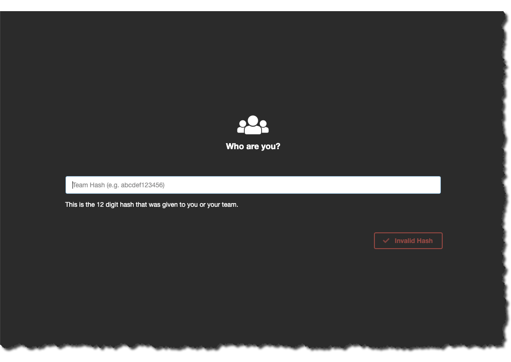
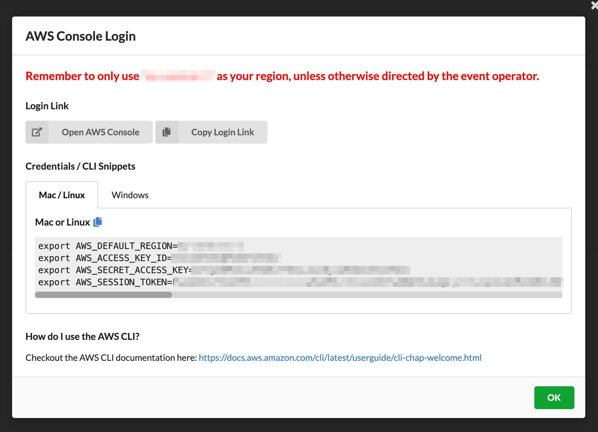

# Getting started

!!! Tip "Account Setup"

    This workshop was designed and built to be run as part of an AWS sponsored event using the **AWS Event Engine**. 
    
    You will get a 12 digit hash code from your instructor to be used to access AWS Event Engine.
    
## AWS Console Access

1. Navigate to https://dashboard.eventengine.run and enter the hash code you received. 

   
2. Sign into your account by clicking 'Proceed', then 'AWS Console' > 'Open AWS Console'. Make sure you work in the region that's associated with your account. **Your region may differ from the region that is shown.**

    

## Setup Cloud9 IDE

This workshop requires you to run commands or scripts you will need to install AWS CLI & text editor on your machine or alternatively you can launch [AWS Cloud9](https://aws.amazon.com/cloud9/) instance which will provide you with a cloud-based integrated development environment (IDE) that lets you write, run, and debug your code with just a browser. 

!!! Warning
    The Cloud9 workspace should be built by an IAM user with Administrator privileges, not the root account user. Please ensure you are logged in as an IAM user, not the root account user.

??? Tip 
    Ad blockers, javascript disablers, and tracking blockers should be disabled for the cloud9 domain, or connecting to the workspace might be impacted. Cloud9 requires third-party-cookies. You can whitelist the specific domains.

Below are the instructions for launching an instance:

- In the AWS Management Console, on the **Services** menu, in the **Developer Tools** group click **[Cloud9](https://console.aws.amazon.com/cloud9)**.
- Click **Create environment** on the right side.
- Enter a **Name** (eg. `neptune-workshop`) and click **Next step**.
- Leave all the defaults and click **Next step**.
- Click **Create environment**.
- The environment will open automatically after it has been provisioned. Browse back to the AWS Cloud9 console and you can click **Open IDE** on the environment you created to access it at anytime.
- Keep the Cloud9 IDE tab open in your browser.
  
Open another browser tab for AWS Console:

- Back into Event Engine dashboard and click **Open AWS Console** to open AWS Console in a new tab 
