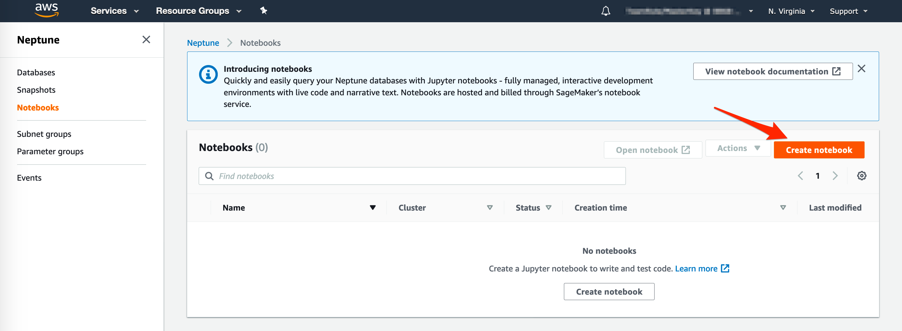
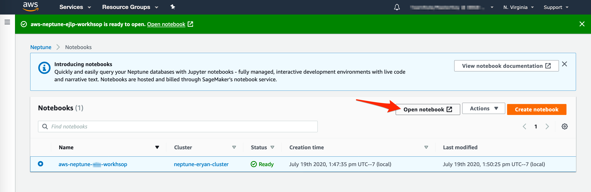
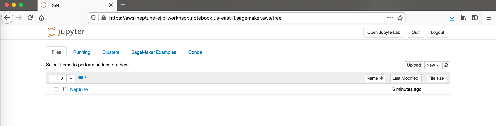
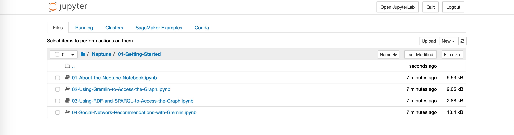
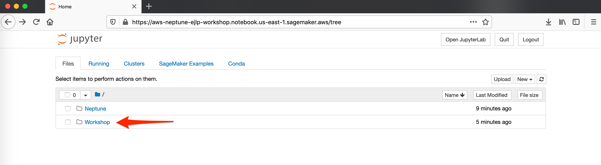
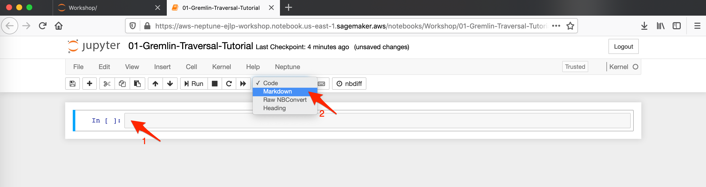
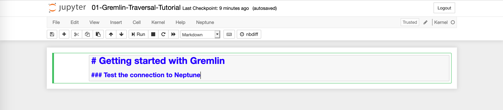
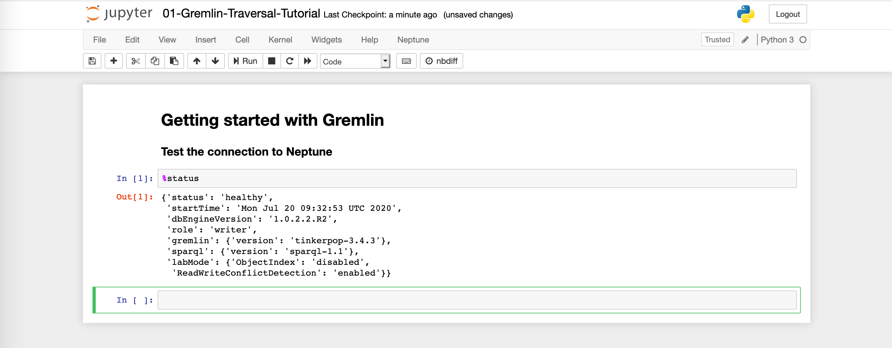

# Work with Neptune through Jupyter Notebook

This section will get you hands-on with working with your Neptune cluster through Jupyter Notebooks, a fully managed, interactive development environments with live code and narrative text. Although commonly used for machine learning algorithms, Jupyter Notebooks make it easy for us to connect to and interact with our databases. 

You’ll get a chance to see how bulk loading works, as well as learning some simple and advanced Gremlin and SPARQL queries. The final notebook will test your Gremlin and SPARQL query skills!

## Creating a Notebook 

1. Open the [Amazon Neptune console](https://console.aws.amazon.com/neptune/home).
2. In the navigation pane, choose **Notebook**.
3. Click **Create notebook** button to create a new Jupyter notebook 

    

4. In the Create notebook page, 
    - **Cluster**: `neptune-{YOURNAME}-cluster`
    - **Notebook instance type**: ml.t3.medium
    - **Notebook name**: `aws-neptune-{YOURNAME}-workshop`
    - Keep choosing **Create new IAM role** 
    - Put your name in the IAM role, so it become `AWSNeptuneNotebookRole-{YOURNAME}`
    - Keep **Network configuration** as default
5. Click **Create notebook** and wait until its status become "Ready". It will takes a while, about 6-10 minutes.
   
   
## Using Notebook
1. From the list of Notebook, select the notebook you've just created: `aws-neptune-{YOURNAME}-workshop`
2. Click **Open notebook**. It will open the notebook in a new browser tab.

    

3. On the notebook's home page you can see a file explorer. 
   Click on the folder **Neptune**, then folder **01-Getting-Started**

    

    You can see list of precreated sample scripts for you to start exploring Graph data on Neptune.
    

    

4. Click notebook file `02-Using-Gremlin-to-Access-the-Graph.ipynb` to see the content of the notebook.
   
    !!! Warning "Stop"
        But don't do anything yet! You will start by creating a new notebook from scratch.
        Your workshop facilitator will explain about the basic of Jupyter Notebook or ask her/him to do so!

## Create a notebook from scratch

1. Back to Notebook home page, where you can see `Neptune` folder.
2. Click **New** button and then select **Folder**. Scroll down if you don't see **Folder** in the list. 
3. Select **Untitled Folder**, the new created folder and then click **Rename**.
    Change the folder's name to `Workshop`

    

4. Click the folder **Workshop** to go inside it, then click **New** and select **Python 3**. A new tab will open.
   
5. Click the text **Untitled** on the top of the page to rename it to `01-Gremlin-Traversal-Tutorial`
6. Select the cell, a boxes right after `In [ ]:`, then change the cell mode from **Code** to **Markdown**

    

7. Type following text, then press [SHIFT]+[Enter] or you can also click **Run** button
    ```
    # Getting started with Gremlin

    ### Test the connection to Neptune  
    ```
     
     See the image below
    

8. In the second cell in **Code** mode, write `%status` then press [SHIFT]+[Enter] or click **Run**.

    It will run the code and you will get the output of the command below the cell.

     


    

